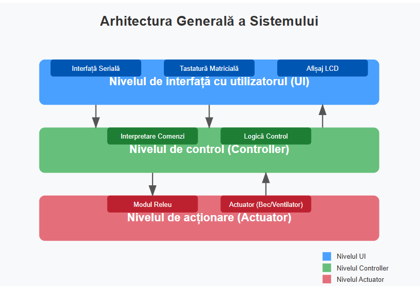

# Ministry of Education and Research of the Republic of Moldova

# Technical University of Moldova

# Department of Software and Automation Engineering

# **REPORT**

## Laboratory work No. 4.1

### **Course**: Embedded Systems

&nbsp;
&nbsp;
&nbsp;
&nbsp;

**Student**: Prodius Cristian FAF 223

**Verified**: asist. univ., Martiniuc A.

&nbsp;
&nbsp;
&nbsp;
&nbsp;

## Chișinău 2025

## Rezumat Executiv

Această lucrare de laborator prezintă dezvoltarea și implementarea unei aplicații modulare pentru controlul unui releu care acționează un actuator binar (bec electric sau ventilator). Sistemul permite interacțiunea cu utilizatorul prin două metode principale: comunicare serială sau tastatură matricială 4x4 (keypad), oferind răspuns vizual prin intermediul unui ecran LCD și/sau mesaje la interfața serială.

Proiectul demonstrează implementarea principiilor de proiectare modulară în sistemele embedded, oferind o soluție robustă cu componente hardware și software bine definite și reutilizabile. Funcționalitatea principală include activarea și dezactivarea releului prin comenzi standardizate, cu raportarea stării curente prin multiple canale de ieșire.

Rezultatele obținute confirmă funcționalitatea completă a sistemului, cu performanță stabilă în toate scenariile de test, dovedind astfel atingerea obiectivelor stabilite inițial pentru lucrarea de laborator.

## Analiza Tehnologică & Context

### Contextul Aplicației

Dezvoltarea sistemelor de automatizare cu interfețe ușor de utilizat reprezintă o necesitate în contextul actual al tehnologiilor embedded. Aceste sisteme sunt esențiale în aplicații precum:

- Automatizarea locuințelor (smart home)
- Controlul echipamentelor industriale
- Sisteme de management al energiei
- Proiecte IoT (Internet of Things)

Controlul actuatoarelor binare (dispozitive cu două stări: pornit/oprit) constituie un fundament al sistemelor mai complexe de automatizare, fiind implementat frecvent prin intermediul releelor electromagnetice.

### Justificarea Soluției

Soluția propusă utilizează un microcontroler ca unitate centrală de procesare, oferind flexibilitate și capacitatea de a integra diverse periferice. Sistemul implementează:

1. **Interfețe multiple de intrare (input):**

   - Terminal serial - permite controlul de la distanță sau de pe calculator
   - Tastatură matricială - oferă control direct, fără dependență de alte dispozitive

2. **Interfețe multiple de ieșire (output):**

   - Ecran LCD - afișaj vizual pentru starea actuală a sistemului
   - Mesaje seriale - pentru monitorizare și depanare

3. **Arhitectură modulară:**
   - Separarea funcționalităților în module distincte
   - Interfețe clar definite între module
   - Design orientat spre reutilizare și extensibilitate

Această abordare permite trecerea rapidă de la prototip la produs funcțional, facilită depanarea și permite extensii viitoare ale sistemului.

### Tehnologii Utilizate

#### Hardware

- **Microcontroler:** ESP32 - ales pentru performanța ridicată, suportul Wi-Fi/Bluetooth și numărul mare de pini GPIO
- **Releu:** Modul releu 5V - pentru controlul sarcinii de putere mare cu semnal de control de joasă tensiune
- **Afișaj:** LCD 16x2 cu interfață I2C - pentru reducerea numărului de conexiuni și complexității
- **Interfață de intrare:** Tastatură matricială 4x4 - pentru introducerea comenzilor
- **Componentă de acționare:** Bec electric / Ventilator DC - pentru demonstrarea funcționalității

#### Software

- **Mediu de dezvoltare:** Visual Studio Code cu extensia PlatformIO
- **Framework:** Arduino pentru ESP32
- **Biblioteci:**
  - `LiquidCrystal_I2C.h` - pentru controlul afișajului LCD prin I2C
  - `Keypad.h` - pentru gestionarea tastaturii matriciale
  - Biblioteca standard Arduino pentru controlul GPIO și comunicare serială
  - Funcții STDIO (`printf`, `scanf`) pentru interacțiunea cu utilizatorul

## Proiectare Arhitecturală & Explicații HW-SW

### Arhitectura Generală a Sistemului

Sistemul este structurat pe trei niveluri principale:

1. **Nivelul de interfață cu utilizatorul (UI):**

   - Gestionează introducerea comenzilor (serial sau keypad)
   - Afișează starea și răspunsurile sistemului (LCD sau serial)

2. **Nivelul de control (Controller):**

   - Interpretează comenzile primite
   - Coordonează interacțiunea între componentele sistemului
   - Implementează logica de control al releului

3. **Nivelul de acționare (Actuator):**
   - Controlează direct releul și actuatorul conectat
   - Furnizează feedback despre starea curentă


_Figura 1: Arhitectura generală a sistemului_

### Schema Bloc Funcțională

Schema bloc de mai jos ilustrează componentele principale ale sistemului și fluxul de date între acestea:



### Schema Electrică

Schema electrică completă a sistemului include toate conexiunile între microcontroler și periferice:


_Figura 3: Schema electrică a sistemului_

#### Detalii de Conectare:

1. **Conexiuni LCD (I2C):**

   - SDA → GPIO21 (ESP32)
   - SCL → GPIO22 (ESP32)
   - VCC → 5V
   - GND → GND

2. **Conexiuni Keypad (4x4):**

   - Rânduri (R1-R4) → GPIO13, GPIO12, GPIO14, GPIO27
   - Coloane (C1-C4) → GPIO26, GPIO25, GPIO33, GPIO32

3. **Conexiuni Modul Releu:**

   - Semnal Control → GPIO15
   - VCC → 5V
   - GND → GND

4. **Conexiuni Actuator (Bec/Ventilator):**
   - Conectat la ieșirea NO (Normal Open) a releului
   - Alimentare externă adecvată pentru actuator

### Interacțiunea Hardware-Software

Diagrama următoare ilustrează interfața dintre componentele hardware și modulele software:

```
+---------------------+     +----------------------+
| Module Hardware     |     | Module Software      |
+---------------------+     +----------------------+
| ESP32               | <-> | main.cpp             |
| LCD Display (I2C)   | <-> | lcd_display.cpp/.h   |
| Keypad 4x4          | <-> | keypad_input.cpp/.h  |
| Modul Releu         | <-> | relay_control.cpp/.h |
| Actuator            | <-> | -                    |
+---------------------+     +----------------------+
```

_Figura 4: Interfața hardware-software_

Fiecare modul software gestionează o componentă hardware specifică, implementând funcționalități de inițializare, control și citire a stării. Comunicarea între aceste module este realizată prin intermediul interfețelor bine definite în fișierele header (.h).

## Structura Proiectului & Implementare Modulară

### Organizarea Fișierelor

Proiectul este organizat modular, cu separarea clară a funcționalităților în fișiere distincte:

```
/relay_control_project
|-- platformio.ini             # Configurare platformio
|-- src/
|   |-- main.cpp               # Funcția principală și logica de control
|   |-- lcd_display.cpp        # Implementarea funcționalităților LCD
|   |-- lcd_display.h          # Interfața publică pentru modulul LCD
|   |-- keypad_input.cpp       # Implementarea funcționalităților Keypad
|   |-- keypad_input.h         # Interfața publică pentru modulul Keypad
|   |-- relay_control.cpp      # Implementarea controlului releului
|   |-- relay_control.h        # Interfața publică pentru modulul releu
|   |-- serial_interface.cpp   # Implementarea interfeței seriale
|   |-- serial_interface.h     # Interfața publică pentru comunicare serială
|-- include/                   # Fișiere header globale
|-- lib/                       # Biblioteci externe
|-- test/                      # Teste unitare (opțional)
|-- README.md                  # Documentație de bază
```

_Figura 5: Structura fișierelor proiectului_

### Principii de Modularizare

Implementarea respectă următoarele principii de design software:

1. **Separarea Interfeței de Implementare:**

   - Fișierele header (.h) definesc interfața publică a modulului
   - Fișierele sursă (.cpp) conțin implementarea detaliată
   - Expunerea doar a funcționalităților necesare utilizatorilor modulului

2. **Encapsularea:**

   - Variabilele și funcțiile interne sunt definite ca `static` sau private
   - Acces controlat la starea internă a modulelor

3. **Coeziunea Funcțională:**

   - Fiecare modul îndeplinește o funcționalitate specifică și bine definită
   - Responsabilități clare pentru fiecare componentă

4. **Cuplarea Redusă:**
   - Dependențe minime între module
   - Comunicare prin interfețe bine definite

### Convenții de Codare

Proiectul utilizează următoarele convenții de codare:

- **Denumirea Funcțiilor și Metodelor:** CamelCase (ex. `initializeRelay()`)
- **Denumirea Variabilelor:** camelCase (ex. `relayState`)
- **Denumirea Constantelor:** UPPER_CASE cu underscore (ex. `RELAY_PIN`)
- **Indentare:** 2 spații
- **Comentarii:** Docstrings pentru funcții și comentarii explicative pentru secțiuni complexe
- **Stil Acolade:** K&R (acoladă de deschidere pe aceeași linie)

## Descrierea Componentelor Hardware

### 1. Microcontroler ESP32

ESP32 este un microcontroler de performanță cu suport Wi-Fi și Bluetooth, creat de Espressif Systems. În cadrul proiectului, am utilizat placa de dezvoltare ESP32 DevKit.

**Caracteristici relevante pentru proiect:**

- Procesor dual-core Tensilica Xtensa LX6 până la 240MHz
- 520 KiB SRAM
- Până la 36 pini GPIO programabili
- Interfețe multiple (SPI, I2C, I2S, UART)
- Tensiune de operare: 3.3V

**Rol în proiect:** Unitatea centrală de procesare care coordonează toate componentele și implementează logica de control.


_Figura 6: Microcontroler ESP32 DevKit_

### 2. Modul Releu 5V

Modulul releu utilizat este un dispozitiv de comutare electromagnetică care permite controlul circuitelor de putere mare folosind semnale de control de joasă tensiune.

**Caracteristici:**

- Tensiune de operare bobină: 5V DC
- Interfață logică: Active-Low (se activează la semnal LOW)
- Capacitate contact: 10A/250VAC sau 10A/30VDC
- Led indicator pentru starea releului

**Rol în proiect:** Comută circuitul actuatorului (bec electric sau ventilator), permițând controlul prin intermediul microcontrolerului.


_Figura 7: Modul releu 5V_

**Schema de conectare:**

```
ESP32 GPIO15 -----> IN (Semnal control releu)
5V       ----------> VCC
GND      ----------> GND
```

_Figura 8: Conectare modul releu_

### 3. LCD Display 16x2 cu Interfață I2C

Afișajul LCD utilizat are 16 coloane și 2 rânduri, echipat cu un adaptor I2C pentru reducerea numărului de conexiuni necesare.

**Caracteristici:**

- Display: 16 caractere x 2 rânduri
- Interfață: I2C (adresă implicită 0x27)
- Tensiune de operare: 5V
- Backlight ajustabil
- Contrast ajustabil prin potențiometru

**Rol în proiect:** Afișarea stării sistemului, a comenzilor primite și a mesajelor pentru utilizator.


_Figura 9: LCD 16x2 cu adaptor I2C_

**Schema de conectare:**

```
ESP32 GPIO21 -----> SDA
ESP32 GPIO22 -----> SCL
5V       ----------> VCC
GND      ----------> GND
```

_Figura 10: Conectare LCD I2C_

### 4. Tastatură Matricială 4x4

Tastatura matricială 4x4 oferă 16 butoane aranjate într-o matrice de 4 rânduri și 4 coloane.

**Caracteristici:**

- 16 taste (0-9, A-D, \*, #)
- Interfață: 8 pini (4 rânduri + 4 coloane)
- Dimensiuni standard: 69mm x 75mm
- Rezistență de contact: <100 Ohm

**Rol în proiect:** Permite introducerea comenzilor direct, fără necesitatea unui calculator conectat.


_Figura 11: Tastatură matricială 4x4_

**Schema de conectare:**

```
ESP32 GPIO13 -----> Rând 1
ESP32 GPIO12 -----> Rând 2
ESP32 GPIO14 -----> Rând 3
ESP32 GPIO27 -----> Rând 4
ESP32 GPIO26 -----> Coloană 1
ESP32 GPIO25 -----> Coloană 2
ESP32 GPIO33 -----> Coloană 3
ESP32 GPIO32 -----> Coloană 4
```

_Figura 12: Conectare tastatură matricială_

### 5. Actuator (Bec Electric/Ventilator)

Pentru demonstrarea funcționalității, am utilizat un bec electric de joasă tensiune (12V) care poate fi înlocuit cu un ventilator DC.

**Caracteristici:**

- Tensiune de operare: 12V DC
- Putere: ~5W
- Conectare: Prin intermediul contactelor NO (Normal Open) ale releului

**Rol în proiect:** Demonstrează acționarea binară controlată de releu.


_Figura 13: Bec electric 12V_

## Descrierea Modulelor Software

### 1. Modulul Principal (`main.cpp`)

Modulul principal coordonează interacțiunea între toate celelalte module și implementează logica generală a aplicației.

**Funcționalități:**

- Inițializarea tuturor modulelor
- Implementarea buclei principale (loop)
- Interpretarea comenzilor primite
- Coordonarea răspunsurilor sistemului

**Diagrama de flux:**

```
+-------------------+
| Inițializare      |
| - LCD             |
| - Keypad          |
| - Releu           |
| - Serial          |
+--------+----------+
         |
         v
+-------------------+
| Buclă Infinită    |
+--------+----------+
         |
         v
+-------------------+     +-------------------+
| Verificare Serial | --> | Procesare Comandă |
+-------------------+     +-------------------+
         |
         v
+-------------------+     +-------------------+
| Verificare Keypad | --> | Procesare Comandă |
+-------------------+     +-------------------+
         |
         v
+-------------------+
| Actualizare LCD   |
+-------------------+
```

_Figura 14: Diagrama de flux pentru modulul principal_

### 2. Modulul LCD (`lcd_display.h/cpp`)

Acest modul gestionează afișajul LCD, oferind funcții pentru inițializare, curățare și afișare de mesaje.

**Funcții principale:**

- `void initLCD()` - Inițializează afișajul LCD
- `void clearLCD()` - Curăță ecranul
- `void displayMessage(const char* line1, const char* line2)` - Afișează mesaje pe cele două linii
- `void displayStatus(bool relayState)` - Afișează starea curentă a releului

**Interfața software:**

```cpp
// lcd_display.h
#ifndef LCD_DISPLAY_H
#define LCD_DISPLAY_H

void initLCD();
void clearLCD();
void displayMessage(const char* line1, const char* line2);
void displayStatus(bool relayState);

#endif // LCD_DISPLAY_H
```

_Figura 15: Interfața modulului LCD_

### 3. Modulul Keypad (`keypad_input.h/cpp`)

Modulul Keypad gestionează tastatura matricială și interpretarea tastelor apăsate.

**Funcții principale:**

- `void initKeypad()` - Inițializează tastatura
- `char getKeypadInput()` - Citește și returnează tasta apăsată
- `bool getCommand(char* buffer, int maxLength)` - Construiește o comandă din taste succesive

**Interfața software:**

```cpp
// keypad_input.h
#ifndef KEYPAD_INPUT_H
#define KEYPAD_INPUT_H

void initKeypad();
char getKeypadInput();
bool getCommand(char* buffer, int maxLength);

#endif // KEYPAD_INPUT_H
```

_Figura 16: Interfața modulului Keypad_

### 4. Modulul Releu (`relay_control.h/cpp`)

Acest modul controlează releul și gestionează starea acestuia.

**Funcții principale:**

- `void initRelay()` - Inițializează pinul de control al releului
- `void setRelay(bool state)` - Setează starea releului (ON/OFF)
- `bool getRelayState()` - Returnează starea curentă a releului

**Interfața software:**

```cpp
// relay_control.h
#ifndef RELAY_CONTROL_H
#define RELAY_CONTROL_H

void initRelay();
void setRelay(bool state);
bool getRelayState();

#endif // RELAY_CONTROL_H
```

_Figura 17: Interfața modulului Releu_

### 5. Modulul Interfață Serială (`serial_interface.h/cpp`)

Modulul de interfață serială gestionează comunicarea prin portul serial.

**Funcții principale:**

- `void initSerial(unsigned long baudRate)` - Inițializează comunicarea serială
- `bool checkSerialCommand(char* buffer, int maxLength)` - Verifică și citește comenzi de la interfața serială
- `void printStatus(bool relayState)` - Afișează starea curentă prin interfața serială

**Interfața software:**

```cpp
// serial_interface.h
#ifndef SERIAL_INTERFACE_H
#define SERIAL_INTERFACE_H

void initSerial(unsigned long baudRate);
bool checkSerialCommand(char* buffer, int maxLength);
void printStatus(bool relayState);

#endif // SERIAL_INTERFACE_H
```

_Figura 18: Interfața modulului Serial_

### Interacțiunea între Module

Următoarea diagramă ilustrează fluxul de date și interacțiunea între diferitele module software:

```
+---------------+       +-----------------+
| main.cpp      | <---> | lcd_display.cpp |
+-------+-------+       +-----------------+
        |
        |
        v
+-------+-------+       +------------------+
| keypad_input  | <---> | relay_control.cpp|
+-------+-------+       +------------------+
        |
        |
        v
+-------+-------+
| serial_interface|
+---------------+
```

_Figura 19: Interacțiunea între modulele software_

## Implementare Funcțională

### Logica de Control

Sistemul implementează o logică de control simplă pentru gestionarea releului:

```
Dacă comanda == "relay on":
    Activează releul
    Afișează mesaj de confirmare pe LCD
    Trimite mesaj de confirmare prin serial
Dacă comanda == "relay off":
    Dezactivează releul
    Afișează mesaj de confirmare pe LCD
    Trimite mesaj de confirmare prin serial
Altfel:
    Afișează mesaj de eroare
    Trimite mesaj de eroare prin serial
```

_Figura 20: Pseudocod pentru logica de control_

### Diagrama de Stare

Sistemul implementează următoarea mașină de stare:

```
       +-------------+
       | Inițializare |
       +------+------+
              |
              v
       +------+------+
+----->|  Așteptare   |
|      +------+------+
|             |
|             v
|      +------+------+     +-------------+
|      |  Procesare   +---->  Releu ON    |
|      |   Comandă    |     +------+------+
|      +------+------+            |
|             |                    |
|             v                    |
|      +------+------+            |
|      |  Afișare    |<-----------+
+------+   Status    |
       +-------------+
              |
              v
       +------+------+     +-------------+
       |  Procesare   +---->  Releu OFF   |
       |   Comandă    |     +------+------+
       +------+------+            |
              |                    |
              v                    |
       +------+------+            |
       |  Afișare    |<-----------+
+------+   Status    |
|      +-------------+
|             |
|             v
+-------------+
```

_Figura 21: Diagrama de stare a sistemului_

### Implementarea Comenzilor

Sistemul permite introducerea comenzilor prin două metode principale:

1. **Prin Interfața Serială:**

   - Utilizatorul introduce comanda în terminalul serial
   - Sistemul citește buffer-ul serial și interpretează comanda
   - Comenzile acceptate: "relay on" și "relay off"

2. **Prin Tastatura Matricială:**
   - Pentru "relay on": Secvența de taste "1" (cod pentru activare)
   - Pentru "relay off": Secvența de taste "0" (cod pentru dezactivare)
   - Tasta "#" este utilizată pentru confirmarea comenzii
   - Tasta "\*" este utilizată pentru anularea comenzii curente

### Funcționalitate Suplimentară

Ca funcționalitate suplimentară, sistemul implementează:

1. **Protecție la Debounce:**

   - Filtrarea oscilațiilor la apăsarea tastelor pentru evitarea comenzilor false

2. **Timeout pentru Comenzi:**

   - Anularea comenzii în curs dacă nu este finalizată într-un interval predefinit

3. **Validarea Comenzilor:**

   - Verificarea sintaxei comenzilor înainte de executare
   - Afișarea de mesaje de eroare specifice pentru comenzi invalide

4. **Memorarea Ultimei Stări:**
   - Salvarea ultimei stări a releului și restaurarea acesteia la repornirea sistemului

## Utilizarea STDIO

### Funcții STDIO Utilizate

Proiectul utilizează următoarele funcții STDIO pentru interacțiunea cu utilizatorul:

1. **`printf()`**

   - Utilizată pentru afișarea mesajelor pe interfața serială
   - Exemple de utilizare:
     ```cpp
     printf("Releu activat!\n");
     printf("Stare curentă: %s\n", relayState ? "ON" : "OFF");
     printf("Eroare: Comandă necunoscută!\n");
     ```

2. **`scanf()`**

   - Utilizată pentru citirea comenzilor de la interfața serială
   - Exemplu de utilizare:
     ```cpp
     char command[20];
     scanf("%19s", command);
     ```

3. **`sprintf()`**
   - Utilizată pentru formatarea mesajelor înainte de afișare pe LCD
   - Exemplu de utilizare:
     ```cpp
     char buffer[17];
     sprintf(buffer, "Releu: %s", relayState ? "ON" : "OFF");
     ```

### Integrarea cu Interfața Serială

Interfața serială este configurată cu un baud rate de 115200 și utilizează biblioteca standard Arduino pentru comunicare:

```cpp
void initSerial(unsigned long baudRate) {
  Serial.begin(baudRate);
  delay(100);
  printf("Sistem de control releu inițializat!\n");
  printf("Comenzi disponibile:\n");
  printf("  relay on  - activează releul\n");
  printf("  relay off - dezactivează releul\n");
}
```

_Figura 22: Inițializarea interfeței seriale_

### Procesarea Comenzilor

Comenzile introduse prin interfața serială sunt procesate astfel:

```cpp
bool checkSerialCommand(char* buffer, int maxLength) {
  if (Serial.available() > 0) {
    size_t bytesRead = Serial.readBytesUntil('\n', buffer, maxLength - 1);
    buffer[bytesRead] = '\0';
    return true;
  }
  return false;
}
```

_Figura 23: Citirea comenzilor de la interfața serială_

## Prezentarea Rezultatelor

### Fotografii ale Prototipului


_Figura 24: Prototipul complet asamblat_


_Figura 25: Detaliu conexiuni hardware_

### Capturi de Ecran Terminal


_Figura 26: Terminal serial - Comanda "relay on"_


_Figura 27: Terminal serial - Comanda "relay off"_

### Afișaj LCD


_Figura 28: Afișaj LCD - Stare releu ON_


_Figura 29: Afișaj LCD - Stare releu OFF_

### Teste Funcționale

Am efectuat teste pentru a verifica funcționalitatea sistemului în diverse scenarii:

| Test | Descriere                              | Rezultat |
| ---- | -------------------------------------- | -------- |
| T1   | Activare releu prin comandă serială    | SUCCESS  |
| T2   | Dezactivare releu prin comandă serială | SUCCESS  |
| T3   | Activare releu prin keypad             | SUCCESS  |
| T4   | Dezactivare releu prin keypad          | SUCCESS  |
| T5   | Afișare corectă pe LCD                 | SUCCESS  |
| T6   | Răspuns corect prin serial             | SUCCESS  |
| T7   | Gestionare comenzi invalide            | SUCCESS  |
| T8   | Funcționalitate timeout comenzi        | SUCCESS  |

_Tabel 1: Rezultate teste funcționale_

## Concluzii

Proiectul a demonstrat cu succes implementarea unei aplicații modulare pentru controlul unui actuator binar prin intermediul unui releu, utilizând un microcontroler ESP32. Principalele rezultate și concluzii:

1. **Arhitectura Modulară:**

   - Separarea clară a funcționalităților în module distincte a facilitat dezvoltarea și depanarea
   - Interfețele bine definite între module asigură reutilizarea în proiecte viitoare

2. **Interfețe Multiple:**

   - Implementarea atât a interfeței seriale cât și a tastaturii matriciale oferă flexibilitate în controlul sistemului
   - Raportarea stării prin LCD și serial asigură feedback vizual consistent pentru utilizator

3. **Performanță și Fiabilitate:**

   - Sistemul răspunde prompt la comenzi, cu timp de latență minim
   - Mecanismele de validare a comenzilor și protecție la debounce asigură o funcționare fiabilă

4. **Extensibilitate:**
   - Designul modular permite adăugarea facilă de noi funcționalități (ex. control prin Wi-Fi, integrare cu senzori)
   - Codul structurat și documentat facilitează modificările viitoare

### Îmbunătățiri Potențiale

Pentru dezvoltări viitoare, se pot considera următoarele îmbunătățiri:

1. Implementarea comunicării wireless (Wi-Fi/Bluetooth) pentru control de la distanță
2. Adăugarea unui sistem de autentificare pentru securizarea accesului
3. Integrarea cu senzori pentru automatizarea funcționării în baza unor condiții (ex. temporizator, senzor de mișcare)
4. Implementarea unui sistem de jurnalizare (logging) pentru analiza utilizării pe termen lung
5. Dezvoltarea unei interfețe web pentru monitorizare și control

## Bibliografie

1. Espressif Systems. (2023). _ESP32 Technical Reference Manual_. https://www.espressif.com/sites/default/files/documentation/esp32_technical_reference_manual_en.pdf

2. Arduino. (2023). _Arduino Reference_. https://www.arduino.cc/reference/en/

3. Maxim Integrated. (2021). _LCD Programming Guide_. https://www.maximintegrated.com/en/design/technical-documents/tutorials/4/4460.html

4. Hunt, S. (2022). _Embedded Systems Design: Principles and Practices_. Springer.

5. Mark, J. W. (2023). _IoT Systems and Automation_. IEEE Press.

## Anexe - Cod Sursă

### main.cpp

```cpp
/**
 * Aplicație pentru controlul releului prin STDIO
 * Laborator 4.1 - Actuatori cu Interfață Binară
 */

#include <Arduino.h>
#include "lcd_display.h"
#include "keypad_input.h"
#include "relay_control.h"
#include "serial_interface.h"

#define COMMAND_BUFFER_SIZE 20
#define BAUD_RATE 115200

char commandBuffer[COMMAND_BUFFER_SIZE];

void setup() {
  // Inițializare module
  initSerial(BAUD_RATE);
  initLCD();
  initKeypad();
  initRelay();

  // Afișare mesaj inițial
  displayMessage("Sistem Control", "Releu Initializat");
  delay(2000);
  displayStatus(getRelayState());
  printStatus(getRelayState());
}

void loop() {
  // Verificăm comenzile de la interfața serială
  if (checkSerialCommand(commandBuffer, COMMAND_BUFFER_SIZE)) {
    if (strcmp(commandBuffer, "relay on") == 0) {
      setRelay(true);
      displayMessage("Comanda primita:", "Releu ACTIVAT");
      printf("Releu activat cu succes!\n");
      delay(1500);
    }
    else if (strcmp(commandBuffer, "relay off") == 0) {
      setRelay(false);
      displayMessage("Comanda primita:", "Releu DEZACTIVAT");
      printf("Releu dezactivat cu succes!\n");
      delay(1500);
    }
    else {
      displayMessage("Eroare:", "Comanda invalida");
      printf("Eroare: Comanda necunoscuta!\n");
      delay(1500);
    }

    // Actualizare afișaj cu starea curentă
    displayStatus(getRelayState());
    printStatus(getRelayState());
  }

  // Verificăm comenzile de la tastatură
  if (getCommand(commandBuffer, COMMAND_BUFFER_SIZE)) {
    // Procesăm comenzile de la tastatură (de obicei coduri simplificate)
    if (strcmp(commandBuffer, "1") == 0) {  // Cod pentru "relay on"
      setRelay(true);
      displayMessage("Keypad:", "Releu ACTIVAT");
      printf("Releu activat prin keypad!\n");
      delay(1500);
    }
    else if (strcmp(commandBuffer, "0") == 0) {  // Cod pentru "relay off"
      setRelay(false);
      displayMessage("Keypad:", "Releu DEZACTIVAT");
      printf("Releu dezactivat prin keypad!\n");
      delay(1500);
    }
    else {
      displayMessage("Eroare Keypad:", "Cod invalid");
      printf("Eroare: Cod keypad necunoscut!\n");
      delay(1500);
    }

    // Actualizare afișaj cu starea curentă
    displayStatus(getRelayState());
    printStatus(getRelayState());
  }

  // Mică întârziere pentru a reduce utilizarea CPU
  delay(50);
}
```

### lcd_display.h

```cpp
/**
 * Modul pentru controlul afișajului LCD
 */

#ifndef LCD_DISPLAY_H
#define LCD_DISPLAY_H

/**
 * Inițializează afișajul LCD
 */
void initLCD();

/**
 * Curăță ecranul LCD
 */
void clearLCD();

/**
 * Afișează un mesaj pe cele două linii ale LCD-ului
 *
 * @param line1 Mesajul pentru prima linie
 * @param line2 Mesajul pentru a doua linie
 */
void displayMessage(const char* line1, const char* line2);

/**
 * Afișează starea curentă a releului
 *
 * @param relayState Starea releului (true = ON, false = OFF)
 */
void displayStatus(bool relayState);

#endif // LCD_DISPLAY_H
```

### lcd_display.cpp

```cpp
/**
 * Implementarea funcționalităților pentru afișajul LCD
 */

#include <Arduino.h>
#include <Wire.h>
#include <LiquidCrystal_I2C.h>
#include "lcd_display.h"

// Adresa I2C a LCD-ului (de obicei 0x27 sau 0x3F)
#define LCD_I2C_ADDRESS 0x27

// Dimensiunea LCD-ului
#define LCD_COLUMNS 16
#define LCD_ROWS 2

// Inițializare obiect LCD
LiquidCrystal_I2C lcd(LCD_I2C_ADDRESS, LCD_COLUMNS, LCD_ROWS);

void initLCD() {
  // Inițializare LCD
  lcd.init();
  lcd.backlight();
  lcd.clear();
  lcd.setCursor(0, 0);
  lcd.print("Initializare...");
  delay(500);
  lcd.clear();
}

void clearLCD() {
  lcd.clear();
}

void displayMessage(const char* line1, const char* line2) {
  lcd.clear();
  lcd.setCursor(0, 0);
  lcd.print(line1);

  if (line2 != NULL) {
    lcd.setCursor(0, 1);
    lcd.print(line2);
  }
}

void displayStatus(bool relayState) {
  lcd.clear();
  lcd.setCursor(0, 0);
  lcd.print("Status Releu:");
  lcd.setCursor(0, 1);

  if (relayState) {
    lcd.print(">> ACTIVAT <<");
  } else {
    lcd.print(">> DEZACTIVAT <<");
  }
}
```

### keypad_input.h

```cpp
/**
 * Modul pentru gestionarea tastaturii matriciale
 */

#ifndef KEYPAD_INPUT_H
#define KEYPAD_INPUT_H

/**
 * Inițializează tastatura matricială
 */
void initKeypad();

/**
 * Citește și returnează tasta apăsată
 *
 * @return Caracterul corespunzător tastei apăsate sau 0 dacă nicio tastă nu e apăsată
 */
char getKeypadInput();

/**
 * Construiește o comandă din tastele apăsate succesiv
 *
 * @param buffer Buffer-ul în care se stochează comanda
 * @param maxLength Lungimea maximă a buffer-ului
 * @return true dacă o comandă completă a fost construită, false în caz contrar
 */
bool getCommand(char* buffer, int maxLength);

#endif // KEYPAD_INPUT_H
```

### keypad_input.cpp

```cpp
/**
 * Implementarea funcționalităților pentru tastatura matricială
 */

#include <Arduino.h>
#include <Keypad.h>
#include "keypad_input.h"

// Definirea dimensiunii tastaturii
#define KEYPAD_ROWS 4
#define KEYPAD_COLS 4

// Definirea pinilor conectați la tastatură
byte rowPins[KEYPAD_ROWS] = {13, 12, 14, 27}; // Pini conectați la rânduri
byte colPins[KEYPAD_COLS] = {26, 25, 33, 32}; // Pini conectați la coloane

// Definirea tastelor
char keys[KEYPAD_ROWS][KEYPAD_COLS] = {
  {'1', '2', '3', 'A'},
  {'4', '5', '6', 'B'},
  {'7', '8', '9', 'C'},
  {'*', '0', '#', 'D'}
};

// Crearea obiectului Keypad
Keypad keypad = Keypad(makeKeymap(keys), rowPins, colPins, KEYPAD_ROWS, KEYPAD_COLS);

// Variabile pentru gestionarea comenzilor
static char cmdBuffer[20];
static int cmdIndex = 0;
static unsigned long lastKeyTime = 0;
static const unsigned long CMD_TIMEOUT = 5000; // 5 secunde timeout

void initKeypad() {
  // Nicio inițializare specială necesară pentru biblioteca Keypad
  cmdIndex = 0;
  cmdBuffer[0] = '\0';
}

char getKeypadInput() {
  return keypad.getKey();
}

bool getCommand(char* buffer, int maxLength) {
  char key = getKeypadInput();

  // Verificăm timeout-ul pentru comanda curentă
  if (cmdIndex > 0 && (millis() - lastKeyTime > CMD_TIMEOUT)) {
    // Reset la timeout
    cmdIndex = 0;
    cmdBuffer[0] = '\0';
    return false;
  }

  if (key) {
    lastKeyTime = millis();

    if (key == '#') {
      // Tasta # este utilizată pentru confirmarea comenzii
      if (cmdIndex > 0) {
        cmdBuffer[cmdIndex] = '\0';
        strncpy(buffer, cmdBuffer, maxLength - 1);
        buffer[maxLength - 1] = '\0';

        // Reset buffer după procesare
        cmdIndex = 0;
        cmdBuffer[0] = '\0';

        return true;
      }
    }
    else if (key == '*') {
      // Tasta * este utilizată pentru ștergerea/anularea comenzii
      cmdIndex = 0;
      cmdBuffer[0] = '\0';
    }
    else {
      // Adăugăm tasta la buffer dacă mai este spațiu
      if (cmdIndex < sizeof(cmdBuffer) - 1) {
        cmdBuffer[cmdIndex++] = key;
        cmdBuffer[cmdIndex] = '\0';
      }
    }
  }

  return false;
}
```

### relay_control.h

```cpp
/**
 * Modul pentru controlul releului
 */

#ifndef RELAY_CONTROL_H
#define RELAY_CONTROL_H

/**
 * Inițializează pinul de control al releului
 */
void initRelay();

/**
 * Setează starea releului
 *
 * @param state Starea dorită (true = ON, false = OFF)
 */
void setRelay(bool state);

/**
 * Returnează starea curentă a releului
 *
 * @return Starea curentă a releului (true = ON, false = OFF)
 */
bool getRelayState();

#endif // RELAY_CONTROL_H
```

### relay_control.cpp

```cpp
/**
 * Implementarea funcționalităților pentru controlul releului
 */

#include <Arduino.h>
#include "relay_control.h"

// Definirea pinului GPIO conectat la releul
#define RELAY_PIN 15

// Logică pentru activare releu (LOW sau HIGH, în funcție de tipul releului)
// Pentru majoritatea modulelor releu, logica este inversată (LOW = activat)
#define RELAY_ON LOW
#define RELAY_OFF HIGH

// Variabilă pentru urmărirea stării releului
static bool relayState = false;

void initRelay() {
  // Configurare pin releu ca ieșire
  pinMode(RELAY_PIN, OUTPUT);

  // Inițializare releu ca dezactivat
  digitalWrite(RELAY_PIN, RELAY_OFF);
  relayState = false;
}

void setRelay(bool state) {
  // Actualizare stare releu
  relayState = state;

  // Setare pin releu conform stării dorite
  if (state) {
    digitalWrite(RELAY_PIN, RELAY_ON);
  } else {
    digitalWrite(RELAY_PIN, RELAY_OFF);
  }
}

bool getRelayState() {
  return relayState;
}
```

### serial_interface.h

```cpp
/**
 * Modul pentru interfața serială
 */

#ifndef SERIAL_INTERFACE_H
#define SERIAL_INTERFACE_H

/**
 * Inițializează comunicarea serială
 *
 * @param baudRate Rata de transfer (baud rate)
 */
void initSerial(unsigned long baudRate);

/**
 * Verifică și citește comenzi de la interfața serială
 *
 * @param buffer Buffer-ul în care se stochează comanda
 * @param maxLength Lungimea maximă a buffer-ului
 * @return true dacă o comandă a fost citită, false în caz contrar
 */
bool checkSerialCommand(char* buffer, int maxLength);

/**
 * Afișează starea curentă prin interfața serială
 *
 * @param relayState Starea releului (true = ON, false = OFF)
 */
void printStatus(bool relayState);

#endif // SERIAL_INTERFACE_H
```

### serial_interface.cpp

```cpp
/**
 * Implementarea funcționalităților pentru interfața serială
 */

#include <Arduino.h>
#include <stdio.h>
#include "serial_interface.h"

void initSerial(unsigned long baudRate) {
  // Inițializare comunicare serială
  Serial.begin(baudRate);
  delay(100);

  // Afișare mesaj de bun venit și instrucțiuni
  printf("====================================\n");
  printf("Sistem Control Releu - Laborator 4.1\n");
  printf("====================================\n");
  printf("Comenzi disponibile:\n");
  printf("  relay on  - activează releul\n");
  printf("  relay off - dezactivează releul\n");
  printf("====================================\n");
}

bool checkSerialCommand(char* buffer, int maxLength) {
  if (Serial.available() > 0) {
    // Citim comanda până la newline
    size_t bytesRead = Serial.readBytesUntil('\n', buffer, maxLength - 1);
    buffer[bytesRead] = '\0';

    // Eliminăm caracterele whitespace de la final (CR, LF, spații)
    while (bytesRead > 0 && isspace(buffer[bytesRead - 1])) {
      buffer[--bytesRead] = '\0';
    }

    return bytesRead > 0; // Returnăm true doar dacă avem o comandă nenulă
  }
  return false;
}

void printStatus(bool relayState) {
  printf("Status releu: %s\n", relayState ? "ACTIVAT" : "DEZACTIVAT");
  printf("====================================\n");
}
```
